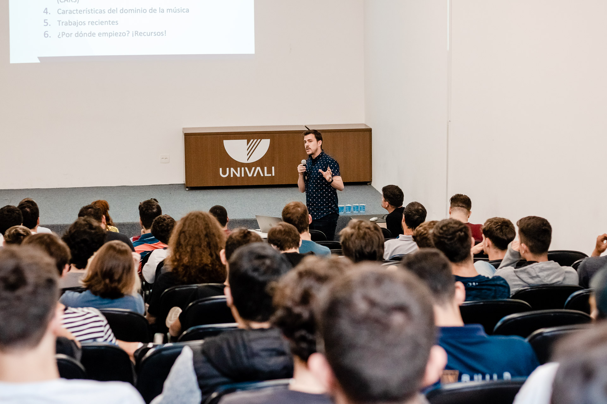

# UNIVALI Introduction to Recsys 2023

  

[*Introduction to Recsys (Talk and Conferences in Universidade do Vale do Itajaí)*](https://github.com/elloza/UNIVALI-Introduction-to-Recsys/blob/main/BR_Sistemas%20de%20recomenda%C3%A7%C3%A3o%20no%20campo%20da%20m%C3%BAsica.pdf)

[Univali recebe professores da Universidade de Salamanca](https://www.univali.br/noticias/Paginas/Univali-recebe-professores-da-Universidade-de-Salamanca.aspx)

  

  

